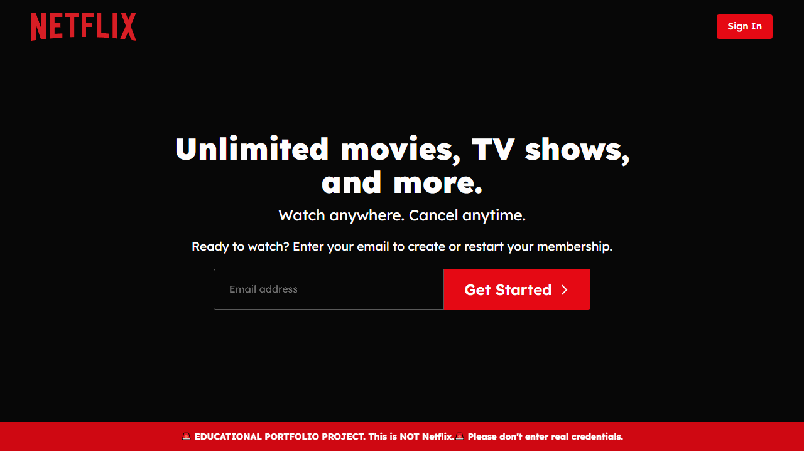
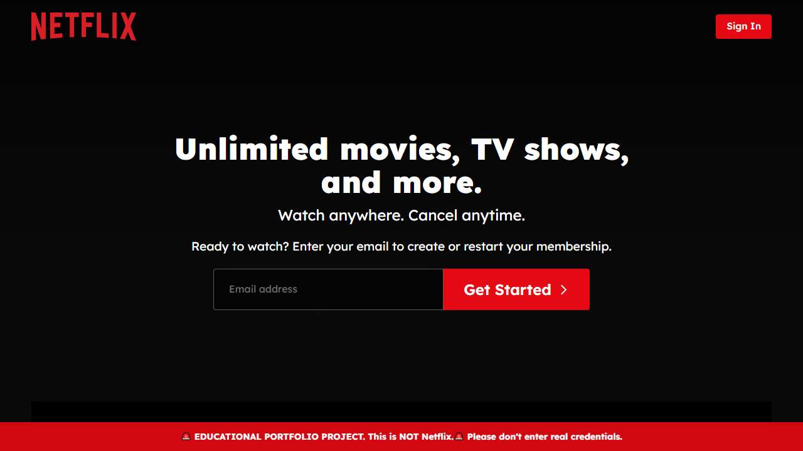
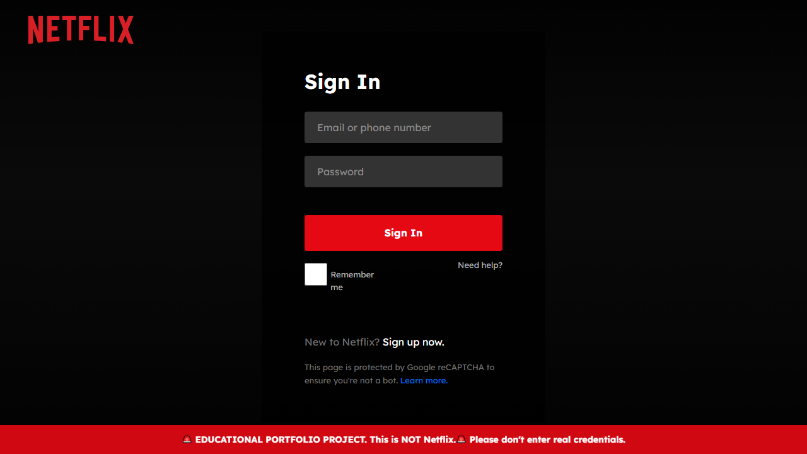
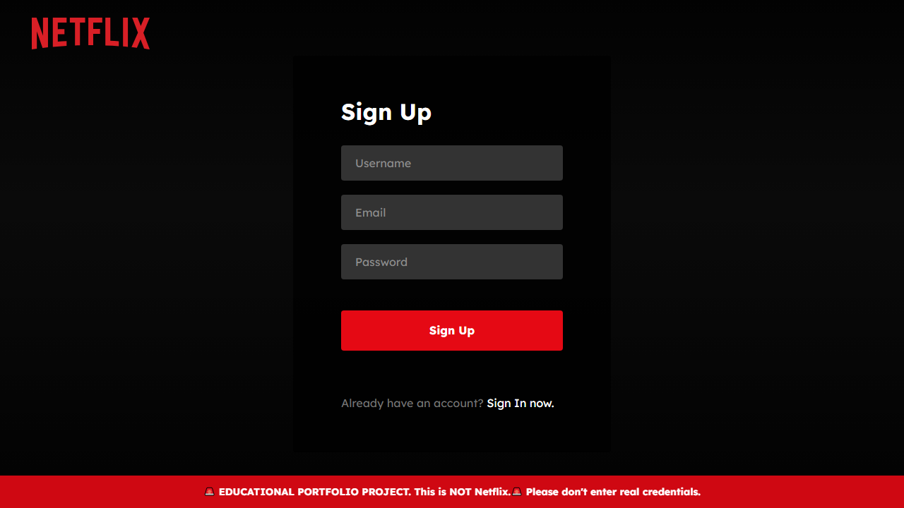

# Netflix Frontend Clone - Client-Ready React Portfolio Project

Netflix-inspired frontend experience engineered for freelance delivery: clean architecture, strong UX polish, and production-ready code quality.

Live-style product goals:
- Keep users engaged with fast, scroll-friendly movie discovery.
- Support account-style flows like login state and personal watchlist.
- Present a clean, responsive UI that feels close to a real OTT platform.

## What Problem This Solves

Many demo projects look good visually but skip real product behavior. This project closes that gap by combining:
- realistic content browsing patterns (banner, rows, details modal, search)
- account-oriented UX (login/registration flow + protected routes)
- personalized retention flow (My List / watchlist interactions)

It demonstrates how to build a frontend that is both visually appealing and product-minded, which is exactly what most freelance clients need.

## My Role / Contributions

I designed and built the frontend architecture end-to-end, including:
- route structure and protected navigation flow
- reusable UI components (Header, Banner, Rows, Modals, Footer)
- movie data rendering and category organization
- search experience and detail modal interactions
- watchlist (My List) integration flow with backend endpoints
- quality pass for lint/build stability and repo readiness for client review

## Tech Stack

- React 19
- Vite 7
- React Router 7
- Axios
- Material UI Icons
- CSS modules/files for component-level styling

## Screenshots

## Demo GIF



## Screenshots

Home


Login


Register


## Features

- Responsive Netflix-style landing and browsing experience
- Dynamic movie rows with category-based requests
- Trailer-enabled movie details modal
- Search route with query handling
- User-auth state and route protection
- Add/remove from personal watchlist (My List)
- Graceful UI feedback with toast-style messaging

## Project Structure

```text
src/
	components/
		Header/
		Banner/
		Rows/
		MovieDetailsModal/
		WelcomeModal/
		Footer/
	pages/
		Landing/
		Home/
		Movies/
		TVShows/
		Latest/
		Search/
		MyList/
		About/
		Login/
	utilis/
		Axios.jsx
		Request.jsx
```

## Run Locally

```bash
npm install
npm run dev
```

Build for production:

```bash
npm run build
```

Lint:

```bash
npm run lint
```

## Environment

Optional environment values:
- `VITE_BACKEND_URL` for watchlist/auth backend integration

If omitted, the app falls back to `http://localhost:5000` for backend API calls.

## Portfolio Pitch

If you are hiring for React frontend work, this repo demonstrates:
- component decomposition and clean folder architecture
- practical state + effect handling patterns
- UX polish for modern media/product interfaces
- code quality checks suitable for team workflows
